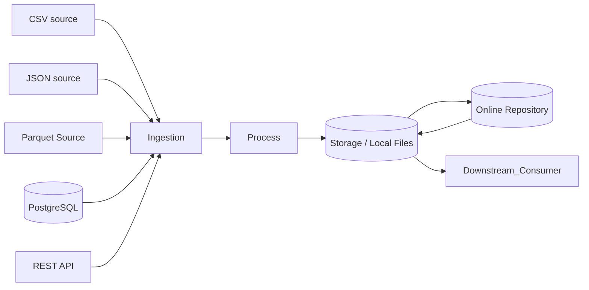

| Lifecycle Element         | What It Means                                                     | Example in This Lab                                                                          | Primary Tool/Artifact             | Possible Failure                                                                           |
|---------------------------|-------------------------------------------------------------------|----------------------------------------------------------------------------------------------|-----------------------------------|--------------------------------------------------------------------------------------------|
| Source system             | The original platform that generated the raw data                 | Unknown systems that producing CSV, JSON, Parquet files, RESTAPI, and a PostgreSQL database. | External to pipeline              | Source System format change or failure to produce data.                                    |
| Ingestion/acquisition     | The collection of raw data to pipeline                            | Reading Flat Files, calling REST API, querying PostgreSQL                                    | Python                            | API timeout or rate limit, connection to Docker Postgres failure. Distortion of files.     |
| Storage                   | The system and format that capture and retain information         | PostgreSQL, local files, online repository                                                   | PostgreSQL, local files, Github   | Storage capacity limits, failed internet access, permission errors, Docker failure to run. |
| Processing/transformation | The process of converting raw data into a downstream ready format | Parsing files into DataFrames, Schema and summary statistics                                 | Python (pandas, pyarrow, scripts) | Type Coercion errors, mistakenly dropped columns and values                                |
| Data quality/validation   | Checking data against defined rules and format                    | Exploratory Data Analysis                                                                    | Python (pandas)                   | Schema Drift, Inconsistent Values                                                          |
| Delivery                  | Making processed data available to downstream users               | Writing the reports                                                                          | I/0 files                         | Wrong output format or directory, incomplete or missing assessments                        |
| Consumer                  | The destination of the processed and formatted data               | Final output                                                                                 | Markdown files, cleaned files     | Consumer misinterpretation, incomplete reports, report not relevant                        |

    